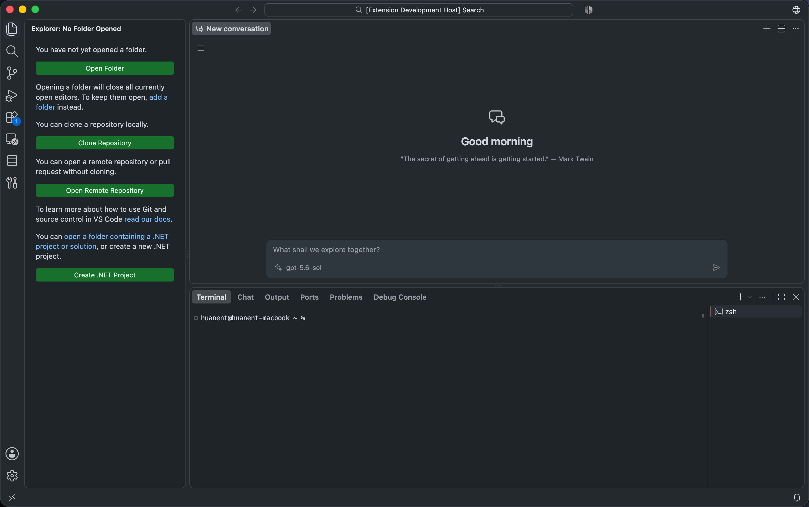

# Only Chat

A focused AI chat editor for VS Code, powered by the Language Model API. Chat with any model available in VS Code without leaving your editor.

## Features

- **Model selection** — Use any language model available in VS Code and switch models for each request.
- **Rich responses** — Stream Markdown with syntax highlighting, tables, and math.
- **Conversation history** — Create, switch, and delete conversations stored in VS Code or a custom directory.
- **Multiple tabs** — Open several chat tabs and continue from shared conversation history.
- **Message controls** — Copy responses, edit earlier messages, regenerate the following conversation, or stop an active request.
- **Custom instructions** — Add a conversation prompt through VS Code settings.

## Usage

1. Install and sign in to an extension that provides language models, such as GitHub Copilot.
2. Run **Only Chat: Open Chat** from the Command Palette, or use the shortcut below.
3. Select a model and enter a message.
4. Press `Enter` to send, or `Shift+Enter` to insert a new line.

VS Code may request permission to access language models when you send the first message.

## Keyboard Shortcuts

| Action | macOS | Windows / Linux |
| --- | --- | --- |
| Open Only Chat / new conversation when focused | `Cmd+Shift+I` | `Ctrl+Shift+I` |
| New chat tab | `Cmd+T` | `Ctrl+T` |

## Settings

| Setting | Description |
| --- | --- |
| `onlyChat.prompt` | Instructions added to every conversation. |
| `onlyChat.storagePath` | Machine-local directory used to store each conversation as a separate JSON file. Supports `~`; reload VS Code after changing it. The value is not included in Settings Sync. |
